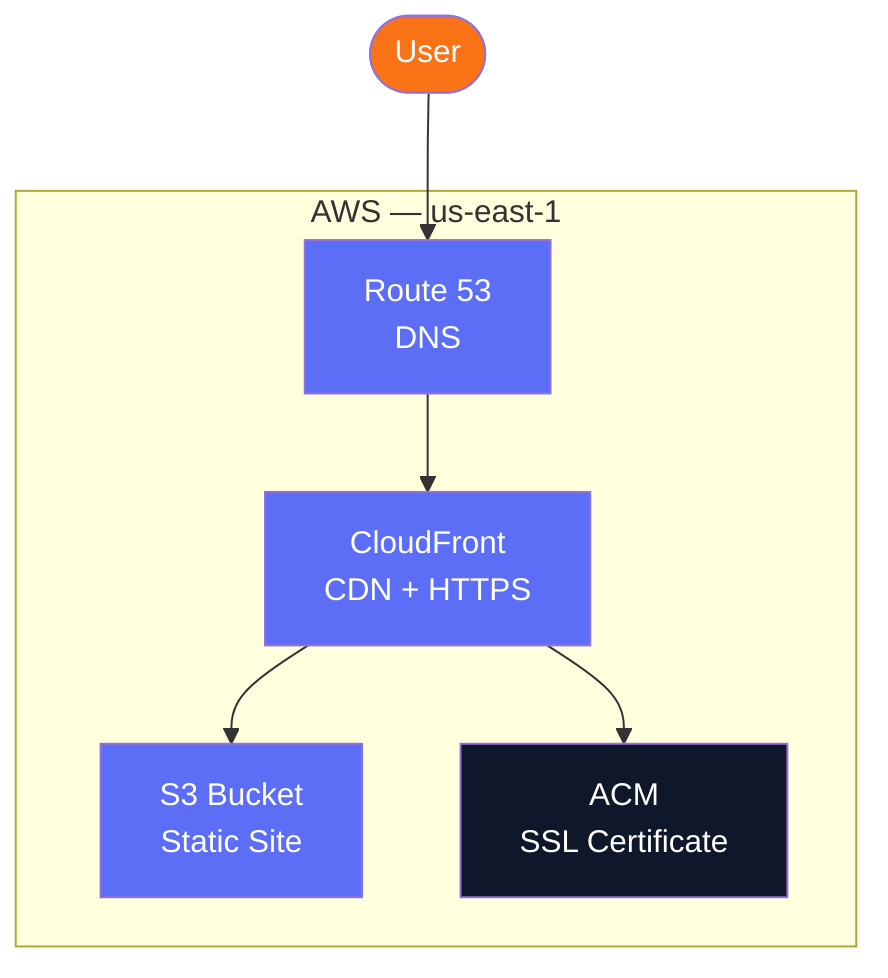
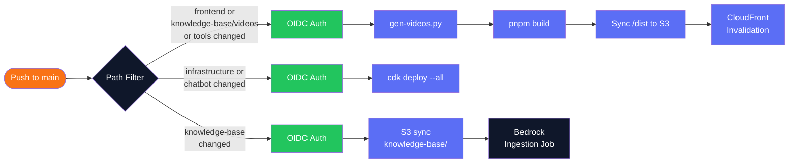
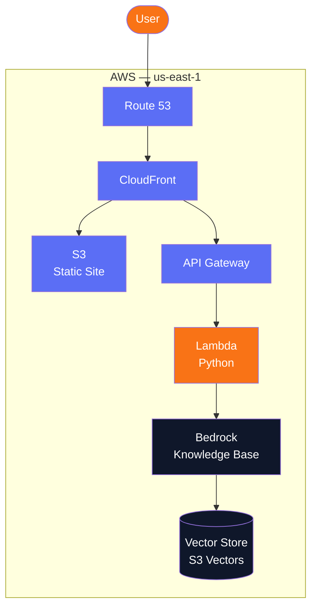
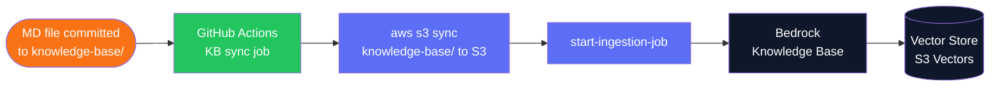
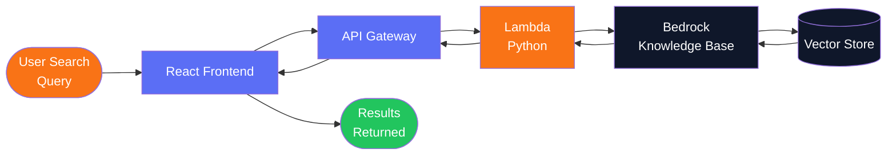

# EverydayAI Tutor — Architecture Diagrams

---

## 1. Launch Architecture

Current infrastructure as deployed at launch.

### Notes
- `aieverydaytutor.com` — canonical, serves the site
- `www.aieverydaytutor.com` — redirects to non-www
- ACM certificate covers both domains (SANs)
- S3 bucket is private — CloudFront accesses via Origin Access Control (OAC)
- CloudFront redirects 403/404 → `index.html` for React Router client-side routing
- All infrastructure in `us-east-1`

---

## 2. CI/CD Pipeline

GitHub Actions workflow triggered on push to `main`. Three independent path-filtered jobs.

### Notes
- Three independent jobs — frontend, infrastructure, knowledge-base — each triggered by separate path filters
- **Authentication:** OIDC — GitHub Actions assumes `GitHubActionsDeployRole` — no long-lived credentials stored
- GitHub secrets: `AWS_ROLE_ARN`, `AWS_REGION`, `BEDROCK_KB_ID`, `KB_BUCKET_NAME`, `BEDROCK_DS_ID`, `VITE_CHAT_API_URL`
- Cache invalidation uses `/*` — counts as 1 path (first 1,000/month free)
- No staging environment — deploys directly to production
- Claude Code creates feature branches and opens PRs; merges to `main` trigger CI

---

## 3. Current Architecture — Full Stack

Full system architecture including the chatbot backend and knowledge base.

---

## 4. Content Ingestion Flow

How Markdown content gets indexed in the Bedrock Knowledge Base for chatbot retrieval.

### Flow Description
1. A Markdown file is committed to `knowledge-base/` (videos or website content) and merged to `main`
2. **GitHub Actions** knowledge-base job runs: `aws s3 sync knowledge-base/ → KB S3 bucket` (with `--delete` so S3 mirrors the repo exactly)
3. **Bedrock ingestion job** is triggered via `bedrock-agent start-ingestion-job`
4. **Bedrock Knowledge Base** chunks the Markdown content, creates vector embeddings, and stores them in the Vector Store
5. Content is now indexed and available for chatbot semantic retrieval

---

## 5. Agentic Search — Query Flow

How a user search query returns semantically relevant results.

### Flow Description
1. User enters a natural language search query in the **React frontend**
2. Frontend calls **API Gateway**
3. **Lambda (Python)** receives the query and calls Bedrock Knowledge Base
4. **Bedrock Knowledge Base** performs semantic vector search against the **Vector Store**
5. Relevant results are returned back through Lambda → API Gateway → Frontend
6. User sees semantically matched results — video content and site information

---

## Key Design Decisions

| Decision | Choice | Reason |
|---|---|---|
| Content source of truth | Markdown files in `knowledge-base/` | Single file per video, git-versioned, drives both frontend cards and chatbot KB |
| Frontend content catalog | Static JSON (videos.json) | Build-time generation — no runtime API, no failure modes, free at any scale |
| Chatbot search index | Bedrock Knowledge Base | Semantic search, natural language queries, managed embeddings |
| Vector store | S3 Vectors | Native AWS vector store — no separate service to manage |
| Lambda runtime | Python | Best Bedrock SDK support |
| KB sync mechanism | GitHub Actions CI (`aws s3 sync` + `start-ingestion-job`) | Simple, event-driven on merge to main, no additional infrastructure |

---

## Notes

- Markdown files are the **source of truth** — frontmatter drives the site, prose drives the chatbot
- No DynamoDB — content pipeline is fully static (build-time JSON generation)
- All Lambdas written in **Python**
- Vector store: S3 Vectors — implemented and deployed
- Chatbot is live — powered by **AWS Bedrock Knowledge Base** with **S3 Vectors**
