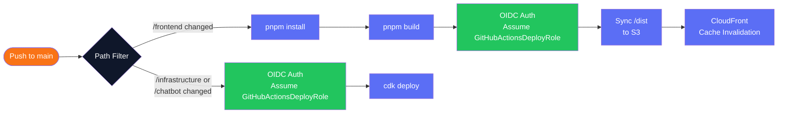
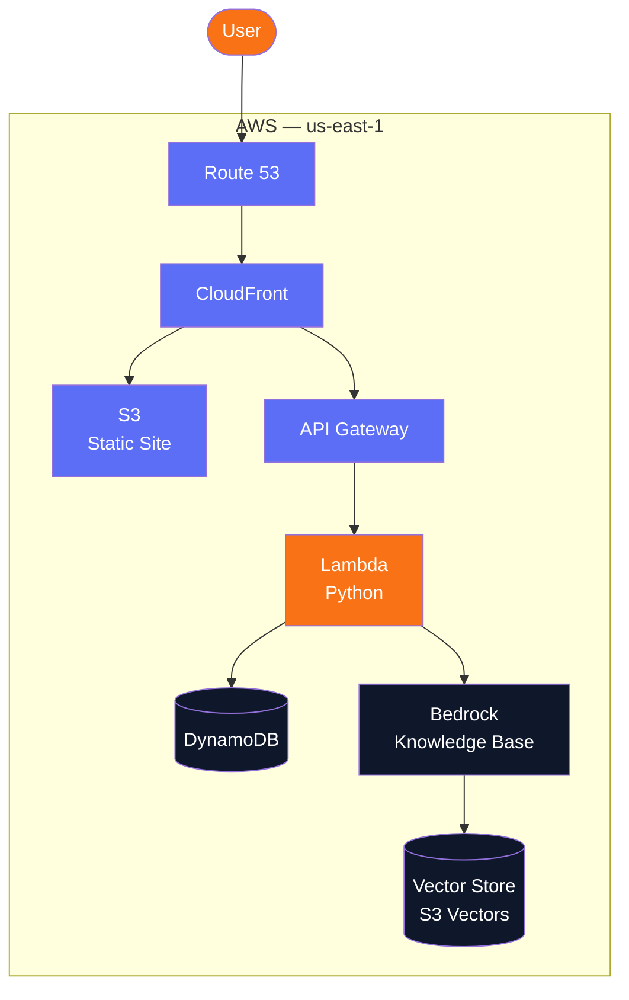
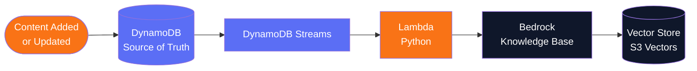

# EverydayAI Tutor — Architecture Diagrams

---

## 1. Launch Architecture

Current infrastructure as deployed at launch.

### Notes
- `aieverydaytutor.com` — canonical, serves the site
- `www.aieverydaytutor.com` — redirects to non-www
- ACM certificate covers both domains (SANs)
- S3 bucket is private — CloudFront accesses via Origin Access Control (OAC)
- CloudFront redirects 403/404 → `index.html` for React Router client-side routing
- All infrastructure in `us-east-1`

---

## 2. CI/CD Pipeline

GitHub Actions workflow triggered on push to `main`.

### Notes
- Frontend and infrastructure jobs run independently via path filtering
- **Authentication:** OIDC — GitHub Actions assumes `GitHubActionsDeployRole` via `aws-actions/configure-aws-credentials`
- **No AWS credentials stored in GitHub** — OIDC issues temporary credentials per run
- GitHub secrets required: `AWS_ROLE_ARN` and `AWS_REGION` only
- Cache invalidation uses `/*` — counts as 1 path (first 1,000/month free)
- No staging environment at launch — deploys directly to production
- Claude Code creates feature branches, pushes, and opens PRs for review before merging to `main`

---

## 3. Current Architecture — Full Stack

Full system architecture including the chatbot backend and knowledge base.

---

## 4. Agentic Search — Content Ingestion Flow

How content gets indexed for semantic search.

### Flow Description
1. A blog post or YouTube video description is added or updated in **DynamoDB**
2. **DynamoDB Streams** detects the change and triggers a Lambda function
3. **Lambda (Python)** processes the content and sends it to Bedrock
4. **Bedrock Knowledge Base** chunks the content, creates vector embeddings, and stores them in the Vector Store
5. Content is now indexed and available for semantic search

---

## 5. Agentic Search — Query Flow

How a user search query returns semantically relevant results.

### Flow Description
1. User enters a natural language search query in the **React frontend**
2. Frontend calls **API Gateway**
3. **Lambda (Python)** receives the query and calls Bedrock Knowledge Base
4. **Bedrock Knowledge Base** performs semantic vector search against the **Vector Store**
5. Relevant results are returned back through Lambda → API Gateway → Frontend
6. User sees semantically matched results — blog posts and video content

---

## Agentic Search — Key Design Decisions

| Decision | Choice | Reason |
|---|---|---|
| Content storage | DynamoDB | Structured data, fast reads, powers site content pages |
| Search index | Bedrock Knowledge Base | Semantic search, natural language queries, managed embeddings |
| Vector store | S3 Vectors | Native AWS vector store — no separate service to manage, cost-effective at any query volume |
| Lambda runtime | Python | Dominant language in AI/ML ecosystem; best Bedrock SDK support |
| Sync mechanism | DynamoDB Streams | Event-driven, no polling, automatic on content change |

---

## Notes

- DynamoDB is the **source of truth** — Bedrock indexes a copy of the content
- All Lambdas written in **Python**
- Vector store: S3 Vectors — implemented and deployed
- Chatbot is live — powered by **AWS Bedrock Knowledge Base** with **S3 Vectors**
